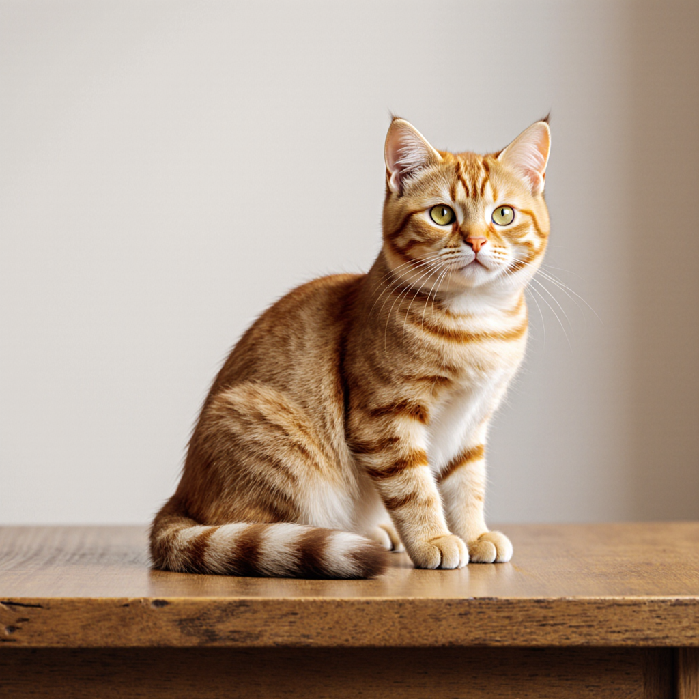

# 05 · 生图 `POST /v1/images/generations`

两个生图模型在 chat 里都是**直接 404**（`supported_endpoint_types` 倒是有 `image-generation`，
但要走本端点）。两个都验证出图，返回体里是 `file://<base64 PNG>`。

```bash
# 很慢！client 超时至少 180s，否则会被误杀
curl -s --max-time 180 $BASE/images/generations \
  -H "Authorization: Bearer $SUANLI_API_KEY" -H 'Content-Type: application/json' \
  -d '{"model":"black-forest-labs/flux.1-krea-dev",
       "prompt":"a small orange cat sitting on a wooden table, photorealistic"}' \
  -o flux.json
python3 -c "
import json,base64
d = json.load(open('flux.json'))
open('cat.png','wb').write(base64.b64decode(d['data'][0]['url'].split('file://',1)[1]))
print('saved cat.png')
```

| 模型 | chat | images/generations |
|---|---|---|
| `black-forest-labs/flux.1-krea-dev` | 404 | ✅ 通，1024×1024 PNG（约 1.2MB，base64 约 1.68MB） |
| `stabilityai/stable-diffusion-3.5-medium` | 404 | ✅ 通，返回结构相同 |

Python（`examples/images.py` 同款）：

```python
import json, base64, urllib.request
BASE = "https://api.suanli.cn/v1"
KEY = "你的 MaaS Key"
req = urllib.request.Request(
    BASE + "/images/generations",
    data=json.dumps({"model": "black-forest-labs/flux.1-krea-dev",
                     "prompt": "a small orange cat sitting on a wooden table, photorealistic"}).encode(),
    headers={"Authorization": "Bearer " + KEY, "Content-Type": "application/json"})
with urllib.request.urlopen(req, timeout=180) as r:
    d = json.loads(r.read())
png = base64.b64decode(d["data"][0]["url"].split("file://", 1)[1])
open("cat.png", "wb").write(png)
```

## 样张

prompt：`a small orange cat sitting on a wooden table, photorealistic`



照片级橘猫，木桌纹理、胡须、绿眼睛都对得上 prompt，商业出图可用。
